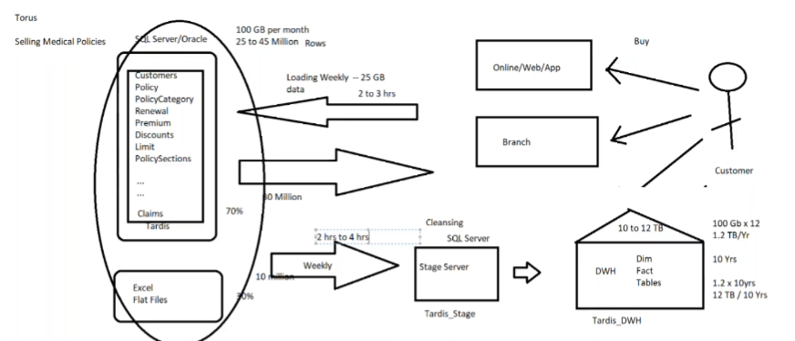
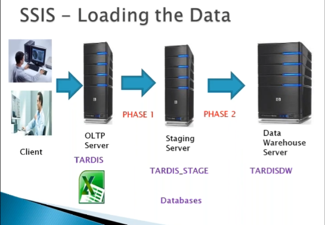

# 🏥 TARDIS – Medical Insurance Data Engineering Project

---

## 📌 1. Project Overview

- **Client:** TORUS (UK)
- **Project Name:** TARDIS
- **Domain:** Healthcare / Medical Insurance
- **Team Size:** 10 Members
- **Project Duration:** 2 Years
- **Module:** Insurance Module
- ---
## Role in the Project

- Created 30 SSIS Packages for Full Load and Incremental Load processing
- Worked extensively on SQL and T-SQL (Stored Procedures, Views, Functions)
- Created and maintained 100+ SSRS Reports
- Attended client and internal team meetings
- Prepared technical documentation
- Performed coding and database development tasks
- Conducted Knowledge Transfer (KT) sessions
- Handled performance tuning and error handling in ETL processes

## Project Description

- It is a Medical Insurance Project from the UK.
- Any customer can purchase a medical policy through web, online platforms, agents, brokers, or third-party channels.
- Policies can be renewed and are purchased from various locations.
- Customers receive deductions when purchasing a policy.
- Each policy has a defined limit on the insured amount.
- Customers pay a premium amount for the given policy on a yearly basis.
  

  

## Project Objectives
- Growth rate in terms of number of customers and profit
- Growth rate for renewals over the last few years
- Analyze new customers ratio
- Analyze renewals ratio
- Analyze time taken to issue new policies
- Analyze customers and their existing policies, and provide recommendations
- Analyze number of claim settlements over the last few years
- Analyze claim settlement amounts over the last few years

  

